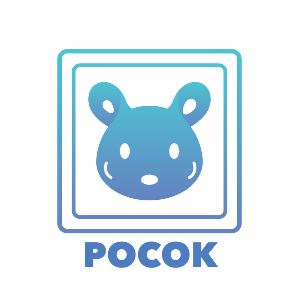

Pocok
=====

.. image:: https://travis-ci.org/shiwaforce/pocok.svg?branch=master
    :target: https://travis-ci.org/shiwaforce/pocok

.. image:: https://img.shields.io/pypi/v/pocok.svg
    :target: https://pypi.python.org/pypi/pocok

.. image:: https://img.shields.io/pypi/pyversions/pocok.svg
    :target: https://pypi.python.org/pypi/pocok

.. image:: https://api.codeclimate.com/v1/badges/62a09af060af69ece1d2/test_coverage
   :target: https://codeclimate.com/github/shiwaforce/pocok/test_coverage
   :alt: Test Coverage

.. image:: https://api.codeclimate.com/v1/badges/62a09af060af69ece1d2/maintainability
   :target: https://codeclimate.com/github/shiwaforce/pocok/maintainability
   :alt: Maintainability

**Pocok** helps to organise and manage Docker, Docker-Compose,
Kubernetes projects of any complexity using simple YAML config files to
shorten the route from finding your project to initialising it in your
local environment.

-  **Simple**. Run any Docker, Docker-Compose, Kubernetes project of any
   complexity in any defined environment just in few command lines.
-  **Flexibility**. Scaling, maintaining projects of any complexity is
   easy as never before.
-  **Configure Once, Use Everywhere**. This is what makes Pocok so
   unique. It is enough just to configure project once so the rest of
   your team will feel the value of zero configuration.

Features
--------

-  **Docker, Docker-Compose, Kubernetes, Helm** support out of the box.
-  **Git, SVN** support out of the box.
-  **Project Catalog, Multiple Catalogues**. Create your own project
   catalog. Organise and your projects without additional tools.
-  **Multiple Plans**. Create multiple plans for different environments
   or even environments for demo purposes. Switch between plans
   (environments) with ease.
-  **Simple Config Files**. Pocok helps to split config files, so it is
   easy to maintain and scale them any time.
-  **Script Support (Hooks)**. Add additional scripts any time.

Documentation
-------------
All documentation is available on `pocok.io`_ - `Documentation`_ -
`Quick Start`_ - `Advanced Guides`_ - `Tutorial`_

.. _pocok.io: https://pocok.io
.. _Documentation: https://pocok.io/documentation
.. _Quick Start: https://pocok.io/quick-start
.. _Advanced Guides: https://pocok.io/advanced-guides
.. _Tutorial: https://pocok.io/tutorial

Requirements
------------

-  Git or SVN
-  SSH
-  Docker (17.0.0 or higher version is recommended)
-  kubectl, for Kubernetes support
-  helm, for helm functionality support

Quick start
-----------

Install ``pocok``:

::

    $:~ pip install pocok

Init project:

::

    $:~ mkdir my-project
    $:~ cd my-project
    $:~ pocok init

``pocok.yml`` and ``docker-compose.yml`` example files will be created.

Start project:

::

    $:~ pocok up

Before adding your project to Pocok Repo create new empty git
repository, add repository to your local Pocok Repo config:

::

    $:~ pocok repo add <name> <git-url>

Now you can add you project to repo:

::

    $:~ pocok project add [<target-dir>] [<catalog>]

Publish your changes:

::

    $:~ pocok repo push

Stop your project:

::

    $:~ pocok stop

Licence
-------

`MIT`_ Copyright (c) 2017-present, `Shiwaforce.com`_
